<div align="center">


<a href="https://github.com/s4nm4rkus">
  
</a>

<br/>


</div>

<br/>

## 👋 About Me

<table>
<tr>
<td width="60%" valign="top">

- 🏫 Currently a **System Analyst / Integrator** at the **Schools Division Office of Tayabas City**, Department of Education (Region IV‑A CALABARZON)
- 💼 1 year of experience across freelance and professional projects, building with **Laravel**, **React Native**, and the **MERN stack**
- 🔧 I specialize in turning manual, paper-based government/school processes into secure, centralized digital systems
- 🚀 Flagship project: **Tayabas ICT Hub** — a centralized portal unifying HR, leave management, ICT ticketing, and attendance for an entire school division
- 🎨 I also design the UI/UX for what I build — Figma, Adobe XD, and Canva are part of my regular toolkit
- 📚 Continuously learning new frameworks and staying current with modern dev practices

</td>
<td width="40%" valign="top">

```yaml
name: San Mark Morcoso
role: Software Developer
based_in: Tayabas City, Philippines
focus:
  - Digitizing government workflows
  - Full-stack systems (Laravel / MERN)
  - Mobile apps (React Native)
currently_building: Tayabas ICT Hub
```

</td>
</tr>
</table>

<br/>

## 🛠️ Tech Stack

<div align="center">

**Languages & Frameworks**


<br/>

**Databases & Platforms**


<br/>

**Design**


</div>

<br/>

## 📊 GitHub Stats

<div align="center">





</div>

<br/>

## 🐍 Contribution Snake

<div align="center">

</div>

<br/>

## 🚀 Featured Projects

<table>
<tr>
<td width="50%" valign="top">

### [ICTHub — SDO Tayabas Centralized System](https://github.com/s4nm4rkus/tayabas-ict-hub)

Centralized platform unifying school units and division offices — role-based access, CS Form No. 6 leave workflow with e-signatures and PDF generation, employee records, certificate requests, attendance tracking, internal messaging, notice boards, and ICT ticketing.

`Laravel` `MySQL` `Bootstrap`

</td>
<td width="50%" valign="top">

### [ICT Unit Ticketing System](https://github.com/s4nm4rkus/ICT_Ticketing)

Full-stack ICT service desk supporting Technical Assistance Forms, HelpDesk Requests, Email Requests, and DTS Requests, with improved request tracking and service delivery.
**Live:** [tayabasict.online](https://tayabasict.online/)

`PHP` `MySQL`

</td>
</tr>
<tr>
<td width="50%" valign="top">

### [MPS School Management System](https://github.com/s4nm4rkus/SDO_TAYABAS_MPS)

Role-based system for DepEd schools to manage sections, students, and Mean Percentage Score (MPS) encoding, with auto-computed MPS/SD, live dashboards, and quarterly CSV-exportable reports.

`React` `Node.js` `Express` `MySQL`

</td>
<td width="50%" valign="top">

### OXY: Smart Indoor Air Sanitizer _(Capstone)_

Android app paired with an IoT device for real-time indoor air quality monitoring and remote control.

`Android Studio (Java)` `Firebase`

</td>
</tr>
</table>

<br/>

## 📈 Activity

<div align="center">

</div>

<br/>

## 📬 Connect With Me

<div align="center">

<a href="mailto:sanmarkusmorcoso@gmail.com">

</a>
<a href="https://github.com/s4nm4rkus">

</a>

</div>


